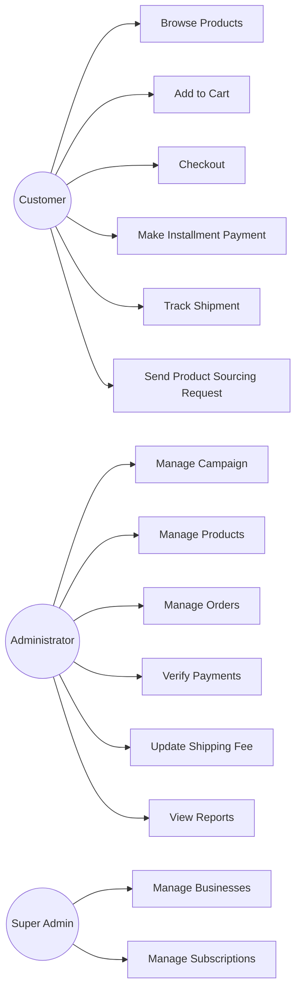
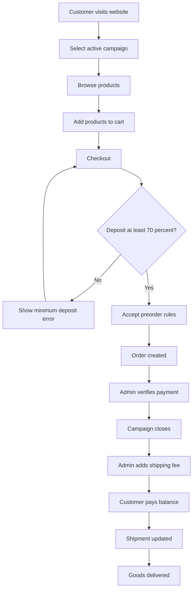
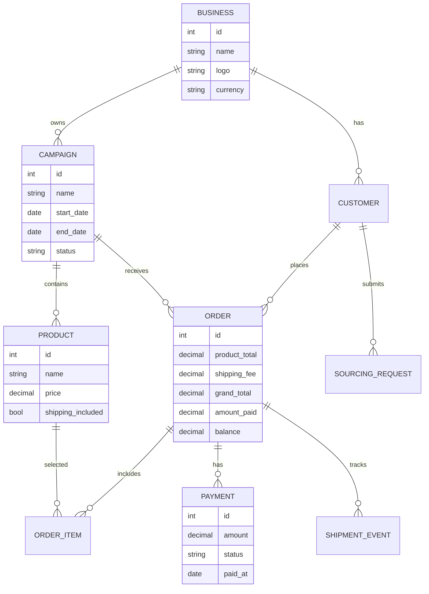

# PreOrderHub Software Specification

## 1. Project Title

**PreOrderHub: A Campaign-Based Preorder Management Platform for WhatsApp Businesses**

## 2. Background

The client runs a China preorder business using WhatsApp. Products are posted on WhatsApp status during a preorder campaign. Customers send orders through chat, pay either fully or in installments, and wait about two months for goods to arrive after orders are placed.

The current approach causes stress because orders, payments, shipping fees, and customer conversations are scattered across WhatsApp chats.

## 3. Business Rules

1. Preorder runs for two weeks before orders are placed.
2. Product prices do not include shipping fee.
3. Shipping fee is communicated later.
4. Goods take about two months to arrive in Nigeria after orders are placed.
5. Prices are fixed and non-negotiable.
6. No exchange or refund after orders are placed.
7. Installment payment is allowed, but the customer must pay at least 70% of the product total before the order is accepted.
8. Customers may send pictures of desired products for sourcing.
9. Customers must pay shipping fee when communicated.
10. Customers must complete payment before collection or delivery.

## 4. Main User Roles

### Administrator

The business owner who manages campaigns, products, orders, customers, payments, shipping fees and reports.

### Customer

The buyer who browses products, places orders, pays in installments, tracks balances and monitors shipment updates.

### Super Administrator (Future SaaS)

The platform owner who manages multiple businesses and subscriptions.

## 5. Functional Requirements

### Campaign Management

- Create preorder campaign
- Set campaign start and end dates
- Display countdown timer
- Close campaign automatically after deadline
- Attach products and orders to campaigns
- Show campaign progress

### Product Management

- Add products
- Upload product images
- Set price, category, quantity, colour and size
- Mark product as available, sold out or closed
- Indicate that shipping fee is not included

### Cart and Checkout

- Add products to cart
- Select size, colour and quantity
- Calculate product total
- Validate minimum 70% deposit
- Require acceptance of preorder rules
- Generate invoice

### Payment and Installment Tracking

- Record full payment
- Record installment payments
- Calculate outstanding balance
- Show payment percentage
- Generate receipts
- Prevent negative balance

### Shipping Fee Management

- Add shipping fee after campaign closure
- Apply shipping fee per order or per item
- Recalculate customer balance
- Notify customers of new balance

### Shipment Tracking

- Preorder open
- Order placed with supplier
- Supplier processing
- International shipping
- Customs clearance
- Arrived in Nigeria
- Ready for pickup
- Delivered

### Product Sourcing Request

- Customer uploads product image
- Customer enters description, size, colour, quantity and budget
- Administrator reviews request
- Administrator responds with price and availability

### Reporting

- Total sales by campaign
- Outstanding balances
- Customers owing shipping fee
- Completed payments
- Best-selling products
- Campaign revenue

## 6. Non-Functional Requirements

- Mobile-first responsive design
- Secure login
- Role-based access control
- Fast page loading
- Daily database backup
- HTTPS deployment
- Simple interface for non-technical users
- Scalable design for SaaS expansion

## 7. Suggested Django Apps

```text
accounts
businesses
campaigns
products
cart
orders
payments
shipping
sourcing
notifications
dashboard
reports
settings_app
```

## 8. Development Roadmap

### Phase 1: Public Demo Frontend

- Landing page
- Campaign banner
- Product catalogue
- Cart mockup
- Checkout mockup
- Customer payment dashboard mockup

### Phase 2: Core Django Backend

- User authentication
- Campaign model
- Product model
- Cart and order model
- Payment and installment model
- Admin dashboard

### Phase 3: Preorder Business Logic

- 70% deposit validation
- Preorder rule acceptance
- Shipping fee calculation
- Outstanding balance update
- Campaign closure

### Phase 4: Deployment

- Push to GitHub
- Deploy on Render or PythonAnywhere
- Connect domain
- Configure database
- Configure media storage

### Phase 5: SaaS Expansion

- Multi-business support
- Subscription plans
- Business branding
- Multiple storefronts
- AI analytics

## 9. UML Diagrams

### Use Case Diagram



### Activity Diagram



### ER Diagram



## 10. GitHub Publishing Recommendation

Use a public repository for documentation and demo only. Use a private repository for production Django code until the platform is ready for commercial launch.
